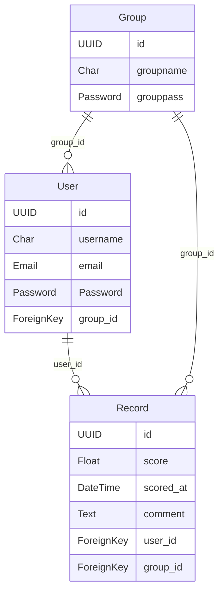

## Installation

Install nvm (Node version manager)

```sh
$ curl -o- https://raw.githubusercontent.com/nvm-sh/nvm/v0.39.7/install.sh | bash
```

Install Node 20.10.0

```sh
$ nvm install v20.10.0
```

Check Node & npm versions

```sh
$ node --version
v20.10.0
$ npm --version
10.2.3
```

Clone this repository and install dependencies

```sh
$ git clone git@github.com:DING-1994/drp-competition-site.git
$ cd drp-competition-site
$ npm install
```

Start local server

```sh
$ npm run dev
# You can check the site at http://localhost:xxxx/
```

## ER Diagram


